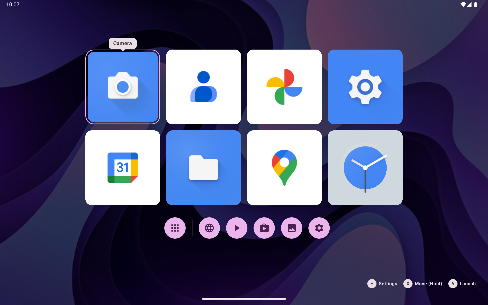
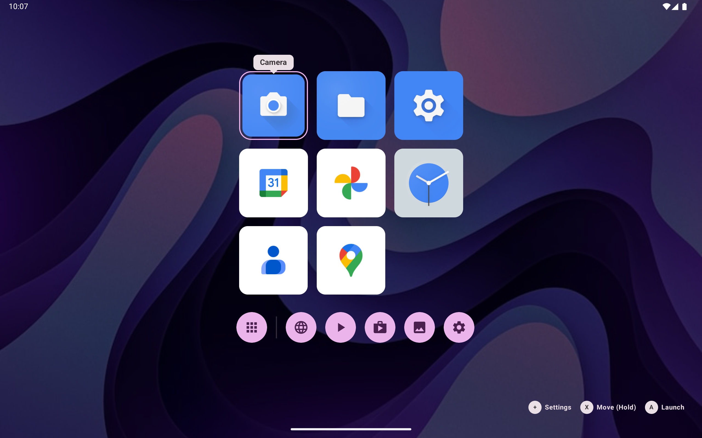

 

# SproutLauncher
SproutLauncher is a modern Android launcher that takes visual inspiration from videogame consoles.

## Features
- **Fully customizable home grid** Row count, spacings, roundness - You name it!
- **Customizable tiles** Override the app icon and title to easily configure your main menu
- **Groups & reordering** Group, ungroup and move app tiles on the home screen for easy organization
- **Quick actions bar** Instant access to YouTube, Discord, Spotify and more (if installed)
- **Theming** Material You support, dark/light mode, wallpaper dimming and included color themes.
- **Shortcut support** Add shortcuts from your favorite emulators to directly jump into the content.
- **Controller and touch support** While the launcher was made for devices with controllers (like the Ayn Odin 3), it also supports touch based navigation

## Screenshots
| 2 Rows | 3 Rows |
| --- | --- |
|  |  |

## License
This project is provided under the GPL-3.0 license. Please refer to the [LICENSE](LICENSE) file for more information.

### AI Disclosure
The code in this repository was not generated through AI. Commit messages may sometimes contain generated commit messages as I did not want to have 40 commits named "wip" in the repository while I was still figuring out what I'm actually doing.